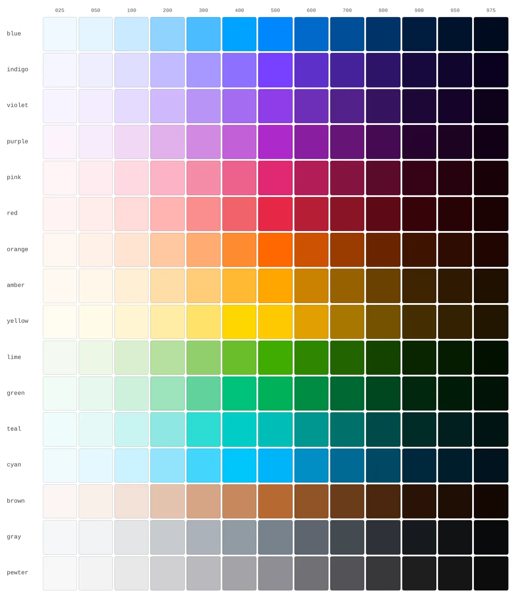
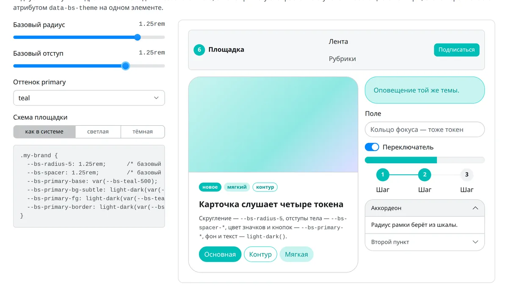
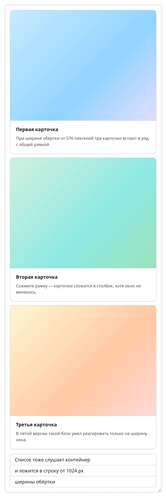
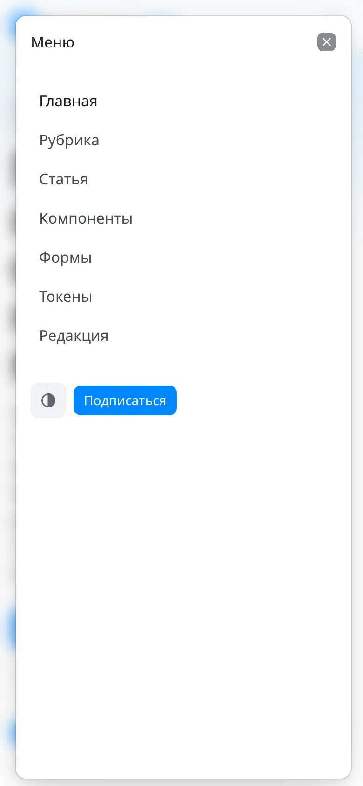
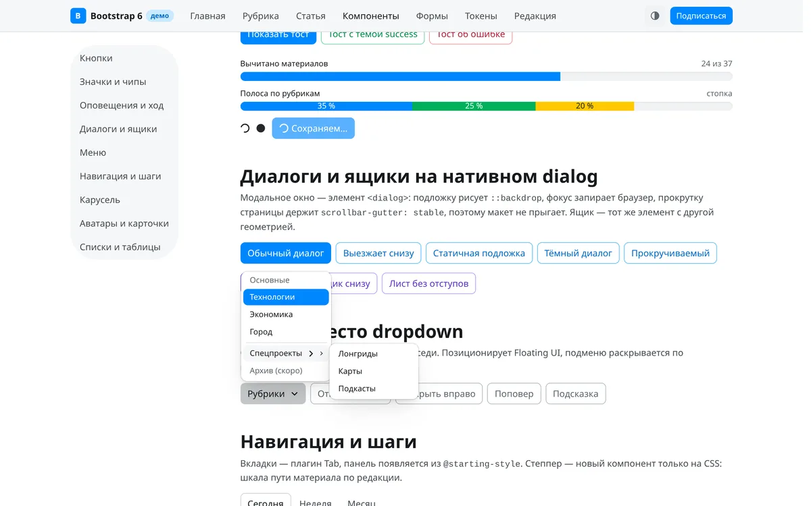
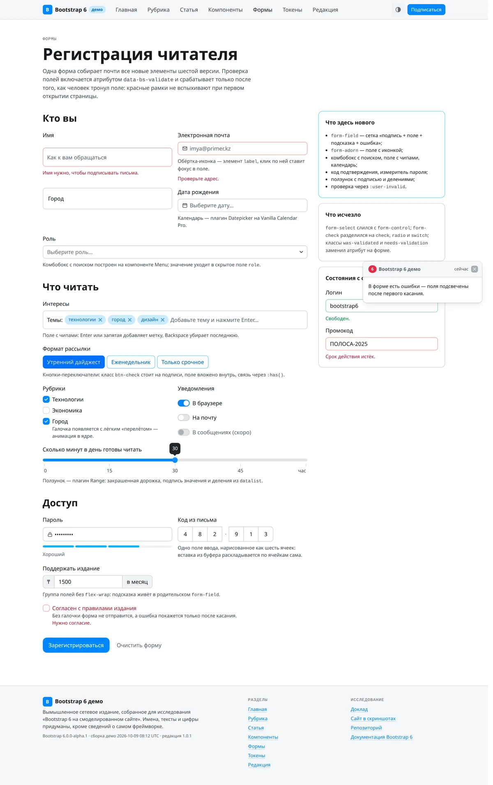
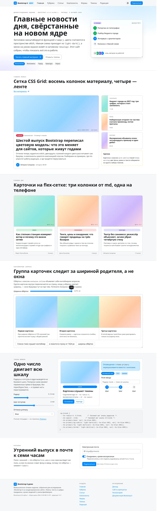
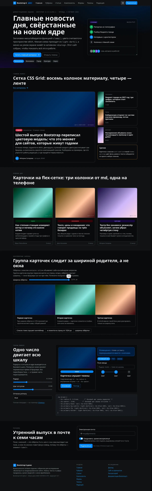

<!-- title: Bootstrap 6 на смоделированном сайте -->
<!-- subtitle: исследование-доклад о шестом поколении фреймворка: архитектура, вёрстка, дизайн -->
<!-- date: редакция 1.0.3 · 9 октября 2026 -->

## Резюме {#rezyume}

Доклад отвечает на вопрос, чем силён шестой выпуск Bootstrap и годится ли он уже сегодня для сайтов, которые живут годами, — в первую очередь для новостных. Ответ двойной. Как инженерная конструкция шестая версия сильна тем, что перенесла оформление из препроцессора в браузер: почти каждая переменная Sass стала переменной CSS, цвета считает сама страница, модальные окна и аккордеоны работают на родных элементах HTML, а каскад разложен по слоям. Как продукт, который можно ставить на боевой сайт, она пока альфа: первый выпуск вышел 8 октября 2026 года, интерфейсы могут измениться до беты, а порог поддерживаемых браузеров поднят до версий осени 2024 года без единого запасного пути [1][2].

Чтобы судить не по анонсу, а по вёрстке, исследование построило на альфе вымышленное сетевое издание — демо-сайт Bootstrap 6. У него семь страниц: главная, рубрика, статья, витрина компонентов, формы, площадка токенов и редакционная панель. С них снято сорок три экрана в настоящем Chromium 153 — для десктопа, телефона, тёмной схемы и открытых состояний. Собственных стилей у сайта один файл, и в нём нет ни одного цвета в шестнадцатеричной записи: всё взято из токенов ядра. Так проверялось главное обещание версии — что оформление настраивается без пересборки.

Три находки держат вывод. Первая: карты токенов и композиция тем работают, как заявлено, — один ползунок двигает всю шкалу радиусов, выбор оттенка перекрашивает кнопки, значки, оповещения и кольца фокуса разом, а тёмная схема приходит из функции `light-dark()` без дублирования правил. Вторая: цена перехода выше, чем у любого прежнего мажора. Переименованы классы кнопок, окон, меню, сетки и утилит; шкала отступов выросла с шести ступеней до тринадцати, и цифра в классе больше не значит того же, что в пятой версии; сжатый CSS потяжелел с 226 до 372 килобайт, а сборка JavaScript — с 78 до 214. Третья: в самой альфе найдены расхождения, которые стоит знать до перехода, — тени собраны на относительном цветовом синтаксисе, который по собственной политике проекта лежит выше порога браузеров, а комбобокс при запуске пишет в консоль ошибку о втором экземпляре. Всё это вынесено в реестры, а не спрятано в тексте.

Для редакций, сидящих на Joomla, вывод практический: ядро системы везёт Bootstrap пятой ветки, и шестая в него не войдёт раньше, чем выйдет из альфы; пробовать её стоит в дочернем шаблоне и на лонгридах, где выигрыш от нативных диалогов, текучей типографики и контейнерных запросов виден сразу.

## Что случилось 8 октября {#anons}

Проект Bootstrap родился в августе 2011 года в Twitter как внутренний набор для единообразия интерфейсов и с тех пор, по подсчёту авторов, установлен больше 1,75 миллиарда раз [1]. Четвёртая версия вышла 18 января 2018 года, пятая — 5 мая 2021 года, последний выпуск пятой ветки, 5.3.8, — 26 августа 2025 года; первый альфа-выпуск шестой лёг в реестр npm 8 октября 2026 года в 16:47 по всемирному времени [3][4]. Между четвёртой и пятой прошло три года и четыре месяца, между пятой и первой альфой шестой — пять лет и пять месяцев.

Анонс написал основатель проекта Марк Отто. Он не скрывает паузы: последние годы ушли на его компанию Pierre и её продукты, и к Bootstrap он вернулся, по его словам, потому что людей, строящих программы, стало больше, чем когда-либо, хотя код они пишут всё реже. Отсюда и формула назначения шестой версии — открытая дизайн-система «для любого, человека или ИИ, новичка или профессионала». Вторым автором версии назван сопровождающий Жюльен Дерамон; в списке участников ветки разработки — восемнадцать человек [1].

Анонс открывает серию из семи записей: обзор и Sass, расширенные цвета и темы, компоненты, сетка, формы, префиксы и утилиты, плагины JavaScript. На момент сдачи доклада вышла первая; остальные обещаны по одной [1]. Поэтому главным источником сведений о версии в докладе служит не блог, а документация и исходный код ветки `main` репозитория по состоянию на 8 октября 2026 года: 141 файл документации, 33 примера, 11 файлов-навыков, 20 плагинов, 117 файлов Sass [5][2].

Выпуск объявлен альфой в точном смысле: до беты обещаны ещё альфы, и «вещи могут измениться существенно». Обратная связь принимается в разделе обсуждений репозитория, ошибки — в задачах, правки — запросами на слияние. Пятая ветка остаётся на поддержке: выпуск 5.4.0 обещан «как только получится», а дата окончания поддержки будет объявлена позже [1][6].

## Порог: браузеры, которых требует шестая версия {#porog}

Шестая версия требует Chrome и Edge от 130-й версии, Firefox от 132-й, Safari от 18-й на macOS, iOS и iPadOS. Пятая работала от Chrome и Firefox 60 и Safari 12. Порог поднят на семьдесят выпусков Chrome, и ниже него нет ничего: ни запасных значений, ни вендорных префиксов, ни полифилов. Страница в старом браузере не «немного поедет» — она отрисуется неверно, о чём руководство по миграции предупреждает крупно [1][7][2].

Документация объясняет порог по функции. Жёсткую нижнюю границу задаёт `light-dark()`: Chrome 123, Firefox 120, Safari 17.5 — ниже неё сборочный конвейер заменял бы функцию полифилом на переменных, а полифил ломает переключение тёмной схемы атрибутом `data-bs-theme`. Остальные функции поднимают планку выше: селектор `:has()` требует Firefox 121, `content-visibility` с дискретными переходами — Firefox 125 и Safari 18, атрибут `name` у элемента `details` для взаимоисключающих аккордеонов — Firefox 130, утилита `text-wrap: balance` — Chrome 130, небуферизованный `backdrop-filter` для подложки диалогов — Safari 18 [7].

Выше порога лежат функции, которых версии пришлось ждать, и документация честно их перечисляет: относительный цветовой синтаксис `rgb(from …)` — Chrome 131 и Firefox 133, «ближайший промах, на одну версию выше нашего порога Chrome»; якорное позиционирование — Firefox 147 и Safari 26, оно избавило бы меню, подсказки, поповеры и комбобокс от библиотеки Floating UI; команды-инвокеры `command` и `commandfor` — Chrome 135, Firefox 144, Safari 26.2; `@scope` — Firefox 146; стилевые контейнерные запросы — Firefox 151. Авторы пишут, что седьмая версия выйдет быстрее прежних мажоров именно ради этих функций [1][7].

Здесь доклад фиксирует первое расхождение. Скомпилированный `bootstrap.css` альфы содержит относительный цветовой синтаксис — запись `oklch(from …)` встречается в нём тридцать пять раз, все в токенах теней `--bs-box-shadow-*`: альфа каждого слоя тени вычисляется из базового цвета именно этим синтаксисом [8][9]. По политике самого проекта этот синтаксис лежит выше порога. Значит, в Chrome 130 и Firefox 132 — то есть на объявленной нижней границе — объявление `box-shadow` с недопустимым значением отбрасывается целиком, и компоненты остаются без теней. Исследование не проверяло это на живом браузере тридцатой версии (под рукой был Chromium 153), поэтому запись идёт в реестр расхождений как Р-02 с оговоркой, а не как доказанный дефект.

Для казахстанского заказчика порог означает одно действие до любых решений: посмотреть в аналитике долю посетителей ниже Chrome 130 и Safari 18. Исследование таких данных не имело, и это белое пятно М-02.

## Архитектура: Sass для логики, CSS для вида {#arhitektura}

Главный тезис версии сформулирован на странице «Подход»: Sass — для программной настройки, CSS — для визуальной. Препроцессор по-прежнему собирает файлы, крутит циклы, порождает варианты компонентов и утилиты; но всё, что касается вида — цвета, отступы, радиусы, шрифты, — живёт в переменных CSS и меняется в браузере. В пятой версии переменные CSS были вторым, неполным слоем поверх переменных Sass; в шестой они стали первым [10].

Устройство держится на трёх решениях. Первое — модульная система Sass: файлы подключаются директивами `@use` и `@forward`, а старый `@import` объявлен устаревшим и для настройки не поддерживается. Точка входа `bootstrap.scss` только переадресует: сначала конфигурация, цвета, тема и корень, затем содержимое, раскладка, формы, кнопки, двадцать пять компонентных файлов, помощники и утилиты. Переопределение делается одной конструкцией `@use "bootstrap" with (…)`, в которую передают и глобальные флаги, и карты токенов [2][5].

Второе — карты токенов. У каждого компонента есть карта вида `$alert-tokens`, где ключи — имена переменных CSS, а значения — ссылки на глобальные токены: `--alert-padding-x: var(--spacer)`, `--alert-border-radius: var(--radius-5)`, `--alert-bg: var(--theme-bg-subtle, var(--bg-1))`. Примесь `tokens()` выводит карту на класс компонента как обычные объявления переменных. Карта `$root-tokens` делает то же для `:root` и `:host` — второй селектор добавлен, чтобы теневые деревья веб-компонентов видели токены; кто переопределит только `:root`, оставит веб-компоненты без своих значений [10][9][2].

Третье — функция `defaults()`. Она сливает карту пользователя с картой ядра, а ключи со значением `null` удаляет. Чтобы поменять один токен, не нужно переписывать всю карту; чтобы добавить свой — тоже. Та же функция собирает глобальные карты: отступы, радиусы, размеры шрифтов, цвета темы, тени, соотношения сторон. В пятой версии карту `$theme-colors` приходилось заменять целиком [8][2].

Префикс `bs-`, который в пятой версии протягивался через каждое объявление переменной Sass `$prefix`, теперь ставит PostCSS на сборке плагином `postcss-prefix-custom-properties`: в исходниках переменные пишутся без префикса, в готовом CSS — с ним. Сменить префикс можно только в настройке PostCSS [1][11].

Весь фреймворк разложен по слоям каскада: `colors, config, root, reboot, layout, content, forms, components, custom, helpers, utilities`. Слой — это ярус в каскаде, объявленный директивой `@layer`; правило из позднего слоя перекрывает правило из раннего, какой бы ни была специфичность селектора. Поэтому утилита всегда побеждает компонент, а помощник — вложенные стили компонента. Слой `custom` ядро оставляет пустым, чтобы проект клал туда свои стили: они перекроют компоненты, но не утилиты. Документация признаёт ограничение: Sass не умеет оборачивать `@use` и `@forward` в `@layer`, поэтому слои объявляются в `_root.scss` и применяются внутри каждого файла отдельно [9][2]. Здесь второе расхождение источников: файл `AGENTS.md` в корне репозитория перечисляет двенадцать слоёв, с `theme` между `colors` и `config`, а объявление в `_root.scss` и скомпилированный CSS содержат одиннадцать [12][9]; принято то, что в коде (Р-03).

Пониже специфичность селекторов опущена и другим способом: конструкция `:where()` встречается в скомпилированном CSS 302 раза, а директива `@property` регистрирует восемь переменных, которыми пользуется API утилит, как ненаследуемые, чтобы значение, поставленное утилитой на родителе, не просочилось в потомков [2].

Инструменты сборки тоже заменены. Исходники JavaScript переведены на TypeScript, и пакет везёт собственные объявления типов. Rolldown заменил Rollup и Babel: он сам снимает типы и понижает синтаксис, целый слой инструментов из репозитория исчез. Тесты идут в Vitest в настоящем Chromium через Playwright вместо Karma. Документацию собирает Astro седьмой версии с поиском Pagefind, а общие компоненты трёх сайтов проекта — документации, иконок и блога — вынесены в закрытый пакет `@twbs/bui` [1][2][13][14][15][16]. Третье расхождение — опять между `AGENTS.md` и кодом: файл называет Astro пятой версии, а `package.json` требует `astro ^7.3.2`, как и анонс (Р-01) [12][5].

## Цвет: oklch, color-mix и light-dark {#cvet}

Цветовая модель — самое глубокое изменение версии, и у него три этажа. Нижний — шестнадцать оттенков, каждый записан одним значением в пространстве oklch: синий `oklch(60% 0.24 240)`, красный `oklch(60% 0.22 20)`, жёлтый `oklch(88% 0.24 88)`. К двенадцати оттенкам пятой версии добавились янтарный `amber`, лаймовый `lime`, фиолетовый `violet`, коричневый `brown` и оловянный `pewter` [17].

Средний этаж — ступени. От базовой ступени 500 вверх идут шесть светлых, 025–400, полученных подмешиванием белого от 94 до 20 процентов, и шесть тёмных, 600–975, с подмешиванием чёрного от 16 до 76 процентов. Смешение делает браузер функцией `color-mix()` в пространстве oklch; пространство задаётся переменной `$color-mix-space`. Итог — 208 цветовых токенов на `:root`, которые площадка демо-сайта читает и показывает без единой константы в разметке [17].

<figure class="shot"><figcaption>Палитра на странице «Токены» демо-сайта: 208 ячеек построены скриптом из переменных <code>--bs-{оттенок}-{ступень}</code>, ни одно значение не задано руками.</figcaption></figure>

Верхний этаж — семантика. Восемь тем — `primary`, `accent`, `success`, `danger`, `warning`, `info`, `inverse`, `secondary` — описаны картой `$theme-colors`, и у каждой девять ролей: `base`, `fg`, `fg-emphasis`, `bg`, `bg-subtle`, `bg-muted`, `border`, `focus-ring`, `contrast`. Роль ссылается на ступень оттенка парой для светлой и тёмной схемы: `--primary-fg: light-dark(var(--blue-600), var(--blue-400))`, `--primary-bg-subtle: light-dark(var(--blue-100), var(--blue-900))`. Отдельные карты задают нейтральные поверхности `--bg-body` и `--bg-1`…`--bg-4`, ступени текста `--fg-body` и `--fg-1`…`--fg-4`, рамки [18].

Темы прикладываются классами. `.theme-primary` ставит на элемент переменные `--bs-theme-bg`, `--bs-theme-fg`, `--bs-theme-border`, `--bs-theme-contrast` и остальные, а компонент их читает. Поэтому кнопка больше не бывает «синей кнопкой» `.btn-primary`: она собирается из формы и темы — `class="btn-solid theme-primary"`, `class="btn-outline theme-danger"`. То же для значков, оповещений, аккордеонов, таблиц, степперов, аватаров, пагинации, чипов. Вложенный блок возвращается к значениям по умолчанию классом `.theme-reset`, который ставит каждой переменной `--theme-*` значение `initial` — именно `initial`, а не `unset`, потому что `unset` снова взял бы значение у родителя [18][2].

Тёмная схема встроена в тот же механизм. Корень объявляет `color-scheme: light dark`, и каждая пара `light-dark()` выбирает значение по предпочтению системы; атрибут `data-bs-theme="dark"` на любом элементе переключает `color-scheme` для поддерева, а флаг `$enable-dark-mode` удалён — тёмный режим компилируется всегда [9][19][2]. Тени в тёмной схеме углубляются сами: токен `--bs-shadow-strength` равен 1 в светлой и 2,4 в тёмной, а каждая тень собрана из нескольких слоёв с альфой, вычисленной из цвета тени. Цвет и сила переопределяются локальными ненаследуемыми переменными `--bs-sc` и `--bs-so`, которые ставят утилиты `.shadow-{цвет}` и `.shadow-opacity-{n}`, — так перекраска тени не просачивается во вложенные тени [8][20]. Корень ставит и `accent-color: var(--primary-base)`, поэтому родные флажки, переключатели, ползунки и полосы хода красятся в цвет темы без единого класса [2].

Одно уточнение, важное для тех, кто захочет перекрашивать сайт на лету. Анонс говорит о палитрах, «которые автоматически подстраиваются под смену базового цвета» [1]. Это верно на этапе компиляции: передав `$blue` через `@use … with`, вы получите все тринадцать ступеней заново. Но в готовом CSS ступени записаны через буквальное значение базы — `--bs-blue-100: color-mix(in oklch, var(--bs-white) 80%, oklch(60% 0.24 240deg))`, — а не через `var(--bs-blue-500)`. Переопределив `--bs-blue-500` в браузере, вы не сдвинете ступени 100 или 900. Чтобы перекрасить тему во время выполнения, нужно переназначить её роли: демо-сайт делает это восемью строками, подставляя ступени другого оттенка, и этот приём стоит знать заранее (запись М-05 в реестре).

<figure class="shot"><figcaption>Площадка токенов после трёх движений: оттенок primary сменён на teal, базовый радиус поднят до 1,25 rem, шаг отступов — до 1,25 rem. Навбар, карточка, кнопки, значки, поле, переключатель, полоса хода, степпер и аккордеон перестроились без пересборки.</figcaption></figure>

## Сетка и адаптивность: префиксы, новые точки, контейнерные запросы {#setka}

Самое заметное изменение в классах — префикс вместо инфикса. Было `.d-md-none`, стало `.md:d-none`; было `.col-lg-6`, стало `.lg:col-6`; было `.opacity-50-hover`, стало `.hover:opacity-50`. Анонс не скрывает источник: «это прямая копия того, как Tailwind делает адаптивность, и да, это лучше, чем инфикс, стоявший в пятой версии словно наугад» [1][21]. Правило действует для утилит, сетки, контейнеров, навбара, ящика, таблиц, списков, липких элементов, стеков, диалога и печати; в HTML двоеточие пишется как есть: `class="md:d-none"` [2].

Префикс не говорит, какой запрос за ним стоит, и это стоит помнить. Утилиты, колонки сетки, контейнеры, ящики и адаптивные таблицы слушают окно; стеки, колонки CSS Grid, раскрытие навбара, горизонтальные списки, группы карточек и стопочные таблицы слушают контейнер. Для вторых родителю нужен класс `.contains-inline` или `.contains-size`, иначе адаптивный класс не сработает вовсе [2][22].

Точки перелома сдвинулись: `lg` — с 992 до 1024 пикселей, `xl` — с 1200 до 1280, бывшая `xxl` стала `2xl` и выросла с 1400 до 1536; контейнеры выросли соответственно до 1200 и 1440 пикселей, контейнер `lg` остался 960. Медиазапросы записаны диапазонами — `@media (width >= 768px)` — вместо `min-width` и `max-width` [8][2]. Сетка на flex осталась двенадцатиколоночной, а сетка на CSS Grid — классы `.grid` и `.g-col-*` — получила утилиты `.grid-cols-1`…`.grid-cols-6`, `.grid-cols-subgrid` и `.grid-auto-flow` [2].

Шкала отступов — главная ловушка миграции. В пятой версии ключей было шесть: 0, 0,25, 0,5, 1, 1,5 и 3 rem. В шестой их тринадцать с шагом 0,125–0,25 rem, и прежние значения уехали на другие ключи: `p-3` означало 1 rem, теперь означает 0,5 rem; 1 rem теперь `p-5`, 1,5 rem — `p-7`, 3 rem — `p-12`. Поиск и замена по классам не поможет, нужна таблица соответствий [2].

Шкала радиусов тоже стала числовой: десять ступеней `--radius-0`…`--radius-9` от одного базового значения `$radius: .5rem` плюс `--radius-pill`; `.rounded` по-прежнему 0,5 rem, но `.rounded-3` теперь 0,25 rem вместо 0,5. Размеры шрифтов — десять ступеней от `xs` до `6xl`, и с ступени `lg` размер задан функцией `clamp()`: он растёт вместе с окном в заданных границах, поэтому библиотека RFS удалена. Классы `.display-1`…`.display-6` и `.lead` убраны без замены: их предлагают собирать из `.fs-6xl .fw-light` и `.fs-lg .fw-light` [8][2].

Отступы и рамки записаны логическими свойствами — `margin-inline-end` вместо `margin-right`, `padding-block-start` вместо `padding-top`: имена классов не изменились, но вёрстка для языков с письмом справа налево получает правильное зеркало без отдельной сборки. В скомпилированном CSS логических объявлений `padding-inline` — 256, `margin-block` — 357 [2]. Появились утилиты `text-balance` и `text-pretty`, динамические высоты `dvh-100` и `min-dvh-100` для мобильных браузеров с убирающейся адресной строкой, `color-scheme-*` для чужих встраиваемых рамок без тёмной темы, волосяная рамка `border-keyline` в полпикселя для плотных экранов [2].

Контейнерные запросы заслуживают отдельного слова. Медиазапрос спрашивает ширину окна; контейнерный запрос спрашивает ширину родителя, и это то, чего верстальщикам не хватало двадцать лет: карточка в узкой боковой колонке и та же карточка на всю полосу должны выглядеть по-разному при одном и том же окне. В шестой версии группа карточек и горизонтальные списки переключаются по контейнеру, а в ядре 36 запросов `@container` [2]. Демо-сайт показывает это на главной: ползунок сжимает рамку, и три карточки складываются в столбик при неизменном окне.

<figure class="shot"><figcaption>Главная страница демо-сайта: рамка с классом <code>contains-inline</code> сжата до 45 процентов ширины полосы, и группа карточек сложилась в столбик, хотя окно браузера осталось 1440 пикселей.</figcaption></figure>

## Компоненты: родные элементы вместо плагинов {#komponenty}

Общая линия версии — отдать браузеру то, что раньше делал JavaScript. Четыре компонента переписаны на родных элементах и свойствах.

Диалог заменил модальное окно и построен на элементе `<dialog>`: три обёртки пятой версии — `.modal`, `.modal-dialog`, `.modal-content` — свёрнуты в один элемент `<dialog class="dialog">`, подложку рисует псевдоэлемент `::backdrop` с размытием, фокус запирает браузер, слой поверх страницы делает инертным тоже браузер, а блокировка прокрутки перенесена в CSS: класс `.dialog-open` ставится на корневой элемент и в паре с `scrollbar-gutter: stable` не даёт странице прыгать при открытии. Внутренние помощники `backdrop`, `focustrap` и `scrollbar` удалены за ненадобностью. Добавились варианты `.dialog-slide-up`, `.dialog-instant`, `.dialog-static`, `.dialog-nonmodal`, `.dialog-scrollable`, немодальный режим и подмена одного диалога другим изнутри [23][2][24].

Ящик — бывший offcanvas — тот же элемент `<dialog>` с другой геометрией: `.drawer-start`, `.drawer-end`, `.drawer-top`, `.drawer-bottom`, вариант `.drawer-sheet` вплотную к краю без отступа и скругления, жест смахивания на сенсорных экранах. Диалог и ящик наследуют общий класс `DialogBase`. Отзывчивый ящик — `.lg:drawer` — ниже точки показывает содержимое ящиком, выше раскладывает его в строку как обычный блок; на этом же построен навбар: сворачивающееся меню пятой версии на плагине Collapse заменено ящиком [25][26][2].

<figure class="shot"><figcaption>Меню демо-сайта на телефоне: ящик <code>drawer-end</code> с отступом от краёв, скруглением и размытой подложкой; выше точки md тот же элемент раскладывается в строку навбара.</figcaption></figure>

Аккордеон переписан на `
` и `
`: взаимоисключающая группа задаётся атрибутом `name`, открытое состояние — селектором `details[open]`, иконка — элементом `.accordion-icon` вместо фонового изображения, а высота анимируется чистым CSS через `interpolate-size` и псевдоэлемент `::details-content` — измерять высоту скриптом больше не нужно. Плагин Collapse тоже перестал писать высоту в строку стиля: он переключает один класс `.show`, остальное делает `interpolate-size`; документация предупреждает, что браузер без этого свойства откроет блок рывком, и «Firefox — тот, за кем стоит следить» [27][2][28].

Карусель переехала на привязку прокрутки: лента — обычный контейнер с `scroll-snap`, поэтому свайп, инерция и клавиатура достаются от браузера, а переходные классы `.carousel-item-next` и прочие удалены. Появились несколько слайдов в ряд, выглядывание соседних, зазоры и центрирование — через переменные `--bs-carousel-items`, `--bs-carousel-items-gap`, `--bs-carousel-items-peek`. Автопрокрутка стала строго опциональной и останавливается при любом вмешательстве пользователя, а кнопка `.carousel-control-play-pause` даёт доступный способ остановить и возобновить её, как требует критерий 2.2.2 WCAG; подписи `.carousel-caption` удалены [29][2][30].

Выпадающее меню стало просто меню: обёртка `.dropdown` не нужна, кнопка и `.menu` — соседи, пункты — плоские `<a class="menu-item">` без списка, направление задаётся атрибутом `data-bs-placement`, позиционирует Floating UI вместо Popper, есть подменю с раскрытием по наведению, клику или обоим. Разделённая кнопка собирается автоматически селектором `:has(+ .menu)` [31][2][32].

Остальные перемены компонентов — в той же логике. Кнопки собираются из формы и темы, получили размер `xs`, квадратный вариант `.btn-icon` и общие с полями токены размеров `--btn-input-*`. Значки — три формы. Карточки: внешняя рамка на `.card`, у шапки и подвала только разделитель, варианты `.card-subtle` и `.card-translucent`, горизонтальная `.card-row`. Хлебные крошки получили явный элемент-разделитель `.breadcrumb-divider` с маской-шевроном вместо псевдоэлемента. Кнопка закрытия рисуется маской в `currentcolor` и сама подстраивается под тёмный фон — класс `.btn-close-white` исчез. Оповещения гаснут плавно без класса `.fade`, тосты, вкладки, подсказки и поповеры анимируются из `@starting-style`; подсказка теперь не исчезает, когда курсор уходит с кнопки на саму подсказку, — так ссылка внутри неё достижима, как требует критерий 1.4.13 WCAG [2][33]. ScrollSpy переписан на `IntersectionObserver` с «линией активации» вместо опроса прокрутки [2].

Новых компонентов пять, не считая форм. Степпер — только на CSS, вертикальный по умолчанию и горизонтальный с модификатором, с темой на каждом шаге. Аватар — с размерами от `xs` до `xl`, индикатором статуса и стопкой. Чип — для меток и выбора, с крестиком удаления. Переполнение навигации `nav-overflow` — приём Priority+: плагин измеряет обёртку и прячет непоместившиеся пункты в меню «ещё». Класс `.prose` оформляет длинный текст из Markdown без классов на каждом элементе, а `.not-prose` выводит из-под его правил вложенный блок; помощник `.hover-lift` приподнимает элемент на наведении и клавиатурном фокусе и уважает `prefers-reduced-motion` [34][35][36][37][38][39].

<figure class="shot"><figcaption>Витрина компонентов: меню «Рубрики» с заголовком группы, разделителем и подменю «Спецпроекты», раскрытым по наведению. Позиционирование — Floating UI.</figcaption></figure>

## Формы: form-field и восемь новых элементов {#formy}

Формы переработаны глубже остального. Основание — `.form-field`: обёртка на CSS Grid, которая расставляет подпись, поле, подсказку и сообщение об ошибке; для флажка и переключателя подпись и описание кладутся в `.form-field-content`, а группы полей собирает `.form-group`. Старые обёртки `.checkgroup` и `.radiogroup` удалены [40][2].

Флажок, переключатель и радиокнопка разделены на три компонента: классы `.check` и `.radio` ставятся прямо на `<input>` без обёртки, их метки рисуются маской на псевдоэлементе, переключатель `.switch` оборачивает поле; появление галочки, точки и ползунка анимировано с лёгким «перелётом» и общими токенами `--control-transition-*`. Кнопки-переключатели перевернуты: класс `.btn-check` стоит на `<label>`, поле вложено внутрь, связь через `:has()` — атрибуты `id` и `for` не нужны [2].

Класс `.form-select` слился с `.form-control`: «слишком много абстракции и дублирования одновременно». Ползунок стал плагином: `.form-range` — обёртка, поле получает `.form-range-input`, плагин рисует закрашенную дорожку, подпись значения и деления из `<datalist>`, потому что кроссбраузерно закрасить дорожку одним CSS нельзя. Обёртка `.form-adorn` для поля с иконкой должна быть элементом `<label>`: обёртка выглядит как поле, и человек ожидает, что клик по иконке поставит фокус в ввод [2][41].

Пять элементов — совсем новые. Комбобокс: кнопка с классом `.combobox-toggle` и меню с пунктами, значение уходит в скрытое поле по атрибуту `data-bs-name`; есть поиск по пунктам и множественный выбор, построен на компоненте Menu. Поле с чипами `.chip-input` с плагином Chips: Enter или запятая добавляет метку, Backspace убирает. Код подтверждения `.otp`: одно поле ввода, нарисованное отдельными ячейками, с группировкой `data-bs-groups="[3,3]"`. Измеритель пароля `.strength` с сегментами или полосой и настраиваемыми порогами. Календарь на библиотеке Vanilla Calendar Pro, добавленной как peer-зависимость; всплывающий календарь закрывается после выбора, по Escape и при уходе фокуса [42][36][43][44][45][46].

Проверка полей больше не использует класс `.was-validated` и голые псевдоклассы `:valid` и `:invalid`. Атрибут `data-bs-validate` на форме включает стили по `:user-invalid` — они срабатывают только после того, как человек тронул поле; значение `valid` добавляет и зелёные состояния. Серверная проверка классами `.is-valid` и `.is-invalid` работает по-прежнему и без атрибута. Встроенные иконки-подсказки в полях удалены вместе с флагом `$enable-validation-icons` [47][2].

<figure class="shot"><figcaption>Страница «Формы» демо-сайта после нажатия «Зарегистрироваться» с пустыми обязательными полями: ошибки показаны только у тронутых полей, поле с чипами приняло метку «дизайн», измеритель оценил пароль как «Хороший», код подтверждения разложился по ячейкам 3+3.</figcaption></figure>

## JavaScript: ESM, TypeScript, промисы {#javascript}

Плагины отныне — только модули ECMAScript. Сборки UMD нет, глобального объекта `window.bootstrap` нет. Для тех, кто пользовался только атрибутами `data-bs-*`, перемена одна: тегу `<script>` нужен `type="module"`, и API данных по-прежнему запускается сам. Кто вызывал плагины через глобальный объект, переходит на явный импорт из той же сборки: `import { Tooltip } from './bootstrap.bundle.min.js'`. Кто собирает проект Vite, Webpack или Parcel, оставляет `import { Tooltip } from 'bootstrap'` — теперь с честным отсечением неиспользуемого кода, а запись `sideEffects` в `package.json` сохраняет слушатели API данных; `require()` из CommonJS придётся заменить [2][1].

Методы `show()`, `hide()`, `toggle()` и `close()` возвращают промис, который разрешается по окончании перехода, — ждать события `shown.bs.*` больше не нужно; промис разрешается и тогда, когда вызов ничего не сделал, поэтому состояние при необходимости проверяют отдельно. Компоненты читают вычисленную длительность перехода и больше не ищут класс `.fade`: нулевая длительность — от `.transition-none`, класса `-instant`, настройки `prefers-reduced-motion` или флага `$enable-transitions: false` — разрешает промис и шлёт событие сразу [2].

Два плагина заменили зависимости: Popper уступил Floating UI в меню, подсказках и поповерах, настройка `popperConfig` переименована в `floatingConfig`; календарь привёл Vanilla Calendar Pro. Обе библиотеки вшиты в `bootstrap.bundle.js`, а отдельный `bootstrap.js` ждёт их снаружи — для прямого подключения в браузере нужна карта импортов [2][32][46]. Плагинов двадцать: alert, button, carousel, chips, collapse, combobox, datepicker, dialog, drawer, menu, nav-overflow, otp-input, popover, range, scrollspy, strength, tab, toast, toggler, tooltip [5]. Toggler — новый универсальный переключатель классов и атрибутов по `data-bs-toggle="toggler"`.

Вес вырос, и доклад не сглаживает это. Сжатый `bootstrap.min.css` — 372 килобайта против 226 у 5.3.8, после gzip 50 против 30; полная сборка `bootstrap.bundle.min.js` — 214 килобайт против 78, после gzip 58 против 23; отдельная `bootstrap.min.js` без зависимостей — 137 против 59. Классов в CSS 3 506 против 2 328, объявлений переменных 1 869 против 1 185, обращений `var(--bs-…)` 3 538 против 1 371 [4][3]. Часть роста — цена универсальности токенов: каждое свойство компонента стало переменной; часть — шесть новых плагинов и две библиотеки. Для новостного сайта с кешем и HTTP/2 разница в двадцать килобайт gzip на CSS не решающая, но при подключении одной сборки на все страницы она есть, и ей надо смотреть в глаза; отсечение неиспользуемого кода при сборке возвращает часть разницы.

## Для людей и агентов: llms.txt и skills {#agenty}

Версия прямо адресована не только верстальщикам, но и программным агентам. Документация отдана в машиночитаемом виде по соглашению llms.txt: `llms.txt` — размеченный указатель всех страниц с описаниями, `llms-full.txt` — вся документация одним файлом для загрузки в контекст модели [48][49][50].

В репозитории появилась папка `skills/` с одиннадцатью «навыками» — пошаговыми инструкциями для агента на одну задачу: установка шестой версии, сборка через npm, Vite, Webpack и Parcel, цветовая система, API утилит, написание компонента на CSS и на JavaScript, миграция с пятой версии (двадцать девять килобайт текста) и миграция с четвёртой. Устанавливаются одной командой `npx skills add twbs/bootstrap` или подключаются файлом `SKILL.md`; авторы просят проверять правки агента по документации [48][51][5].

Файл `AGENTS.md` в корне описывает правила для агентов, работающих с самим репозиторием, и показателен сам по себе: вся проза — ответы, документация, комментарии, сообщения коммитов — пишется на упрощённом техническом английском ASD-STE100, фразы короче двадцати слов, одна инструкция на фразу, ответ агента — до семидесяти пяти слов, без заголовков и таблиц [12]. Это та же дисциплина, которую исследования автора применяют к русскому тексту методологией языкового прогона, только закреплённая в репозитории фреймворка.

Для казахстанских сайтов, которые готовятся к поисковым системам на языковых моделях, пример поучителен: проект, который хочет, чтобы агенты верстали на нём правильно, сам даёт им указатель, полный текст и сценарии. Та же пара файлов `llms.txt` и навыки для агентов уместны у любого сайта редакции [52].

## Смоделированный сайт: демо-издание на Bootstrap 6 {#sayt}

Чтобы говорить о фреймворке предметно, исследование собрало на нём сайт — вымышленное сетевое издание, названное без затей: демо-сайт Bootstrap 6. Семь страниц покрывают то, что нужно новостному сайту и панели его редакции, и одновременно служат витриной.

Главная показывает героя с текучим заголовком `fs-5xl`, сетку CSS Grid «восемь колонок материалу, четыре — ленте», карточки на flex-сетке с подъёмом на наведении, живую демонстрацию контейнерных запросов и площадку токенов. Рубрика — переполнение навигации Priority+, комбобокс сортировки, горизонтальные карточки, скелет загрузки `placeholder-wave`, отзывчивый ящик фильтров `lg:drawer` и пагинацию с темой. Статья — хлебные крошки с явным разделителем, класс `prose` для длинного текста с таблицей и цитатой, диалог «Поделиться» на родном `<dialog>` с копированием ссылки и тостом, аккордеон вопросов на `
`, чипы меток, обсуждение. Витрина компонентов — девять разделов от кнопок до таблиц. Формы — регистрация читателя со всеми новыми элементами. Токены — палитра, темы, живая перестройка, слои, тени, шкала шрифтов. Редакционная панель — боковая колонка, которая на телефоне становится ящиком, карточки показателей, степпер конвейера «репортёр → редактор отдела → корректор → главред → публикация» (та же четырёхступенчатая схема, что в докладе о Joomla [52]), таблица материалов с меню действий и диалог заведения материала.

Сайт собран сборщиком `tools/demo/build_demo.py`: фрагменты страниц оборачиваются общим каркасом — навбар с `md:navbar-expand`, меню в ящике, переключатель цветовой схемы «светлая — тёмная — как в системе» на компоненте Menu, спрайт иконок, подвал. Bootstrap подключён локально из пакета npm, чтобы сайт открывался без сети; собственный `site.css` объявлен в слое `custom` и состоит из трёх десятков правил, где каждое значение — токен ядра: `var(--bs-radius-4)`, `var(--bs-primary-bg)`, `var(--bs-spacer-5)`. Фотографии заменены градиентами на тех же токенах, поэтому и они переходят в тёмную схему сами [1][53].

Снимки сделаны в Chromium 153.0.8010.0 через Playwright 1.56 — сборка Chromium взята из релизов проекта Sparticuz на GitHub, потому что обычная загрузка браузера в песочнице недоступна [54][55]. Десктоп снят при 1440 × 900 с масштабом 2×, телефон — при 390 × 844 с тем же масштабом; тёмная схема включена эмуляцией `prefers-color-scheme`, как её включил бы пользователь в системе, а не атрибутом. Всего сорок три экрана: семь страниц целиком в двух видах, тёмные варианты, крупные планы и открытые состояния — диалог, ящик, меню с подменю, комбобокс, календарь, форма после проверки, перестроенные токены, сжатая рамка, карусель после перелистывания. Разбор каждого снимка вынесен в отдельную страницу «Сайт в скриншотах».

<figure class="shot shot-tall"><figcaption>Главная страница целиком, 1440 пикселей, светлая схема. Снимок прокручивается; по клику открывается оригинал в масштабе 2×.</figcaption></figure>

<figure class="shot shot-tall"><figcaption>Та же главная в тёмной схеме: ни одного дополнительного правила в стилях сайта — пары <code>light-dark()</code> в токенах ядра выбрали вторые значения, тени стали глубже токеном <code>--bs-shadow-strength</code>.</figcaption></figure>

## Разбор: удачные решения {#reshenija}

Десять решений шестой версии исследование признаёт удачными не по описанию, а по опыту вёрстки.

Первое — карты токенов с настройкой во время выполнения. Это самое важное, что произошло с фреймворком: граница между «настроить до сборки» и «подкрутить в браузере» исчезла, и площадка демо-сайта это доказывает восемью ползунками. Для редакции это значит, что спецпроект или дочерний шаблон перекрашивается строкой CSS, а не пересборкой Sass [10].

Второе — композиция тем. Отделение формы от цвета сократило таблицу классов кнопок с шестнадцати до пяти и дало единый приём для всех компонентов; новая тема — одна запись в карте. Ограничение — буквальные базы ступеней, описанное выше, — обходится переназначением ролей [18].

Третье — родной `<dialog>`. Диалог и ящик получили от браузера подложку, ловушку фокуса, инертность и Escape, а фреймворк избавился от трёх внутренних помощников. В демо меню на телефоне, ящик фильтров рубрики, боковая колонка панели и окно «Поделиться» — один и тот же элемент [23][25].

Четвёртое — аккордеон на `
` без JavaScript и с анимацией на `interpolate-size`. Вопросы под статьёй демо-сайта открываются и при выключенных скриптах [27].

Пятое — контейнерные запросы для групп карточек и списков. Демонстрация на главной — самый наглядный экран исследования: окно не менялось, карточки сложились [22].

Шестое — префиксы `md:` вместо инфиксов. Класс читается слева направо как условие: «от md — спрятать». Переучивание недолгое, а чтение чужой вёрстки становится легче [2].

Седьмое — `.form-field`. Одна сетка для подписи, поля, подсказки и ошибки убрала самые частые ручные отступы в формах; в форме регистрации демо-сайта больше двадцати полей, и ни одного класса отступа между подписью и полем [40].

Восьмое — текучая шкала шрифтов на `clamp()`. Заголовок героя на 390 и на 1440 пикселях набран одним классом `fs-5xl`, и ни одного медиазапроса в стилях сайта [8].

Девятое — слои каскада с пустым слоем `custom`. Стили сайта лежат в нём, и ни разу за вёрстку не понадобился `!important` или удлинение селектора: утилита выше, компонент ниже, своё посередине [9].

Десятое — навыки для агентов и машиночитаемая документация. Это не вёрстка, но это то, что решает, как фреймворк будут использовать в ближайшие годы, когда часть вёрстки пишут модели [48].

## Разбор: ловушки и цена перехода {#lovushki}

Исследование записывало каждое место, где вёрстка пошла не так, как ожидалось. Часть ловушек — свойства версии, часть — её альфа-состояние.

Элемент сетки CSS Grid без базового класса `g-col-12` на телефоне занимает одну колонку из двенадцати: заголовок главной вытянулся в столбик по одной букве. Правило простое — всегда ставить базовый класс рядом с префиксным, `g-col-12 md:g-col-8`, — но оно не написано крупно, и в демо его пришлось добавить в двенадцати местах.

Отзывчивый ящик `lg:drawer` выше точки перелома раскладывает `.drawer-body` в строку — это сделано для навбара. Для боковой колонки панели пришлось добавить `lg:flex-column`, иначе аватар, меню и подпись легли в ряд. Класс `.chip-img` рассчитан на ``: вложенный `` выпадает из чипа и всплывает у правого края экрана. Плавающая подпись `.form-floating` в ячейке сетки растягивается на высоту ряда, и подпись уезжает под поле; лечится `align-self-start`. Надписи измерителя пароля и кнопка «More» у переполнения навигации — английские по умолчанию и локализуются только атрибутами `data-bs-messages` и `data-bs-more-text`.

Комбобокс при запуске страницы пишет в консоль ошибку `Bootstrap doesn't allow more than one instance per element`. Причина видна в исходниках: `Combobox` создаёт экземпляр `Menu` на той же кнопке-переключателе, а хранилище экземпляров `dom/data.ts` допускает один экземпляр на элемент и второй отбрасывает с ошибкой. На работу комбобокса в Chromium 153 это не повлияло — меню открылось, значение выбралось, — но экземпляр меню, по-видимому, не регистрируется в хранилище, и в задачи проекта это стоит отправить [56][57] (М-01).

Переименования — главная статья расходов. Их сводная таблица ниже; полный перечень занимает в руководстве по миграции семьдесят шесть килобайт [2].

| было в пятой | стало в шестой | что ещё изменилось |
|---|---|---|
| `.modal`, `.modal-dialog`, `.modal-content` | `<dialog class="dialog">` | один элемент, `::backdrop`, события `*.bs.dialog` |
| `.offcanvas-*` | `.drawer-*` | на `<dialog>`, жест смахивания, `.drawer-sheet` |
| `.dropdown`, `.dropdown-menu`, `.dropdown-item` | `.menu`, `.menu-item` без обёртки | Floating UI, `data-bs-placement`, подменю |
| `.btn-primary`, `.btn-outline-danger` | `.btn-solid.theme-primary`, `.btn-outline.theme-danger` | пять форм × восемь тем, `.btn-xs`, `.btn-icon` |
| `.badge.bg-primary` | `.badge.theme-primary` | `.badge-subtle`, `.badge-outline` |
| `.d-md-none`, `.col-lg-6`, `.offset-md-2` | `.md:d-none`, `.lg:col-6`, `.md:offset-2` | префикс для всех утилит и компонентов |
| `.navbar-expand-md`, `.collapse.navbar-collapse` | `.md:navbar-expand`, `<dialog class="drawer">` | классы `.navbar-light/dark` удалены |
| `.accordion-button`, `.accordion-collapse` | `
`, `
`, `.accordion-body` | группа атрибутом `name` |
| `.form-select`, `.form-check` | `.form-control`, `.check`, `.radio`, `.switch` | `.form-field`, `.btn-check` на `<label>` |
| `.text-*`, `.text-bg-*`, `.bg-light`, `.bg-dark` | `.fg-*`, `.bg-* .fg-contrast-*`, `.bg-1`/`.bg-2` | поверхности следуют схеме |
| `.fs-1`…`.fs-6`, `.display-*`, `.lead` | `.fs-xs`…`.fs-6xl`, сборка из `.fs-* .fw-*` | `clamp()` от `lg` |
| `.rounded-1`…`.rounded-5` | `.rounded-0`…`.rounded-9` | значения сдвинуты, `2rem` эквивалента нет |
| `p-1`…`p-5` (6 ступеней) | `p-0`…`p-12` (13 ступеней) | ключи 2–5 означают другое |
| `$prefix`, `@import`, RFS, `$enable-dark-mode` | PostCSS, `@use … with`, `clamp()`, всегда включён | — |

Три цены сверх переименований. Вес — см. график 5. Порог браузеров — см. главу о пороге и запись Р-02 о тенях. И статус: это первая альфа, и документация прямо говорит, что к бете изменится многое. Внедрять её в боевой сайт сейчас — значит закладывать вторую миграцию.

## Что это значит для Joomla и новостных сайтов {#joomla}

Joomla четвёртого, пятого и шестого поколений везёт в ядре Bootstrap пятой ветки: на нём собраны стандартный шаблон сайта Cassiopeia и шаблон панели Atum, а пакет перечислен в зависимостях ядра [58]. Это значит, что шестая версия войдёт в ядро не раньше, чем выйдет из альфы, и, судя по порогу браузеров, скорее в седьмой мажор, чем в текущую ветку; собственных планов проекта Joomla на этот счёт исследование не нашло (М-04).

Для редакции на Joomla отсюда два пути. Первый — дочерний шаблон: в докладе о Joomla показано, что дочерний шаблон может переопределять любые раскладки и подключать свои стили [52]; на нём можно собрать спецпроект или лонгрид на шестой версии, не трогая остальной сайт, и так проверить и порог браузеров, и вес, и вкус редакции. Второй — не трогать ядро вовсе, но взять из шестой версии приёмы: карты токенов, слой `custom`, `clamp()` для заголовков, `
` для аккордеонов, `<dialog>` для окон — всё это работает в любом шаблоне и в любом фреймворке, потому что это свойства браузера, а не библиотеки.

Для новостного сайта у версии есть прямые подарки. Класс `.prose` — готовая типографика статьи из редактора без классов на каждом абзаце. Отзывчивый ящик — меню и фильтры рубрик на телефоне. Степпер — визуализация конвейера материала в панели редакции. Чипы — метки и подрубрики. Контейнерные запросы — одна карточка для полосы и для боковой колонки. Текучая шкала — заголовки, которые не ломаются на телефонах. Тёмная схема из коробки — для вечернего чтения. И навыки для агентов — для редакции, где часть вёрстки спецпроектов уже делают модели.

Против — три вещи: альфа, порог, вес. Все три со временем смягчатся: выйдет бета, браузеры обновятся, отсечение неиспользуемого кода и сжатие уравняют вес. Поэтому рекомендация ниже — про сроки, а не про отказ.

## Рекомендации {#rekomendatsii}

1. Не переводить боевой сайт на шестую версию до беты; следить за серией из семи записей блога и разделом обсуждений, где принимается обратная связь по альфе [1][6].
2. Уже сейчас снять в аналитике долю посетителей ниже Chrome 130, Firefox 132 и Safari 18 по каждому сайту редакции: это число решит, когда переход возможен (М-02).
3. Собрать на шестой версии один лонгрид или спецпроект в дочернем шаблоне Joomla, взяв за основу демо-сайт исследования: сборщик, каркас и `site.css` переносимы.
4. Перенести в собственные шаблоны четыре приёма версии, не дожидаясь её: токены в переменных CSS с настройкой во время выполнения, слой `custom` в `@layer`, `clamp()` для заголовков, родные `
` и `<dialog>`.
5. При миграции идти по файлу-навыку `skills/bootstrap-v5-v6-migration` и таблице переименований; отдельно проверить каждую цифру в классах отступов и радиусов — поиск и замена здесь не работают.
6. Проверить тени на браузерах нижней границы и, если они пропадают, задать `--bs-box-shadow-*` своими значениями без относительного синтаксиса, пока проект не ответит на Р-02.
7. Положить на сайт редакции `llms.txt` и, если спецпроекты верстают агенты, собственные файлы-навыки с правилами издания — по образцу папки `skills/` фреймворка.

## Глоссарий {#glossariy}

<dl class="glossary">
<dt>oklch</dt><dd>Запись цвета тремя координатами: l — светлота, c — насыщенность, h — тон в градусах. Пространство Oklab предложил шведский инженер Бьёрн Оттоссон в декабре 2020 года как исправление пространства Lab 1976 года: в Lab равный шаг светлоты для синего и жёлтого воспринимался по-разному, в Oklab — одинаково, отсюда и приставка «ok», в разговорном английском «годится». Форма lch — те же данные в полярных координатах, удобных дизайнеру: тон можно крутить, не трогая светлоту. В CSS функция стандартизована в модуле Color Level 4; в Bootstrap 6 ею записаны шестнадцать базовых оттенков, а ступени от них выводит браузер.</dd>
<dt>color-mix()</dt><dd>Функция CSS из модуля Color Level 5, которая смешивает два цвета в заданном пространстве в заданной пропорции: <code>color-mix(in oklch, white 80%, blue)</code>. До неё светлые и тёмные ступени считал препроцессор функциями <code>tint-color()</code> и <code>shade-color()</code> и записывал результат константой; теперь смешение откладывается до отрисовки, и его можно менять, не пересобирая файл. В Bootstrap 6 так построены 208 ступеней палитры, кольца фокуса и полупрозрачные варианты.</dd>
<dt>light-dark()</dt><dd>Функция CSS из модуля Color Level 5: принимает два значения и возвращает первое при светлой схеме, второе при тёмной. Схему определяет свойство <code>color-scheme</code> на элементе; Bootstrap 6 ставит на корень <code>light dark</code>, и браузер следует предпочтению системы, а атрибут <code>data-bs-theme</code> переключает схему для поддерева. Так одна переменная вмещает оба режима, и отдельного файла тёмной темы не существует.</dd>
<dt>слои каскада, @layer</dt><dd>Механизм модуля Cascading and Inheritance Level 5: автор объявляет упорядоченные ярусы, и при конфликте побеждает правило из более позднего яруса независимо от специфичности селекторов. Слово «каскад» дало имя самому языку таблиц стилей — Cascading Style Sheets — и обозначает порядок, в котором правила перекрывают друг друга. В Bootstrap 6 одиннадцать слоёв: от цветов до утилит, с пустым слоем <code>custom</code> для стилей проекта.</dd>
<dt>контейнерные запросы, @container</dt><dd>Правила модуля Containment Level 3, которые применяют стили по размеру элемента-контейнера, а не окна. Элемент становится контейнером свойством <code>container-type</code>; в Bootstrap 6 за него отвечают утилиты <code>contains-inline</code> и <code>contains-size</code>. Группы карточек, горизонтальные списки, стеки, раскрытие навбара и колонки CSS Grid слушают контейнер, остальная адаптивность — окно.</dd>
<dt>токены оформления</dt><dd>Именованные значения дизайна — цвета, отступы, радиусы, тени, шрифты, — из которых собираются компоненты. Термин пришёл из дизайн-систем 2010-х годов: токен, «жетон», — это единица, которую передают между инструментами и платформами, не меняя смысла. В Bootstrap 6 токены — это карты Sass, выведенные переменными CSS на корень и на классы компонентов; компонент читает не цвет, а токен темы.</dd>
<dt>пользовательские свойства CSS, переменные</dt><dd>Свойства с именем на два дефиса — <code>--spacer</code>, — значение которых читается функцией <code>var()</code>. В отличие от переменных препроцессора они живут в браузере, наследуются по дереву, меняются скриптом и переопределяются в любом месте каскада. Префикс <code>bs-</code> в Bootstrap 6 добавляет сборка, чтобы токены не сталкивались с чужими.</dd>
<dt>модульная система Sass, @use и @forward</dt><dd>Способ подключать файлы Sass, появившийся в Dart Sass в 2019 году взамен директивы <code>@import</code>: каждый файл — модуль со своим пространством имён, а переопределение переменных делается при подключении конструкцией <code>with (…)</code>. В Bootstrap 6 точка входа только переадресует модули, и один вызов <code>@use "bootstrap" with (…)</code> настраивает всё.</dd>
<dt>ESM, модули ECMAScript</dt><dd>Стандартный формат модулей JavaScript с ключевыми словами <code>import</code> и <code>export</code>, принятый в редакции языка 2015 года и поддержанный браузерами к 2018 году. В отличие от UMD-сборок модуль не создаёт глобальных переменных, загружается тегом <code>&lt;script type="module"&gt;</code> и даёт сборщику отсечь неиспользуемый код. Bootstrap 6 поставляется только в этом формате.</dd>
<dt>Floating UI</dt><dd>Библиотека позиционирования всплывающих элементов — меню, подсказок, поповеров — относительно их кнопки с учётом краёв окна и прокрутки; преемница Popper от тех же авторов. В Bootstrap 6 пришла на смену Popper и уйдёт, когда якорное позиционирование CSS дойдёт до порога браузеров.</dd>
<dt>элемент dialog</dt><dd>Элемент HTML для модальных и немодальных окон, стандартизованный в HTML Living Standard: метод <code>showModal()</code> открывает окно поверх всего, делает остальную страницу инертной, запирает фокус и закрывает окно по Escape; подложка рисуется псевдоэлементом <code>::backdrop</code>. На нём построены диалог и ящик Bootstrap 6.</dd>
<dt>элемент details</dt><dd>Элемент HTML раскрывающегося блока с заголовком <code>summary</code>: открытие и закрытие делает браузер, а атрибут <code>name</code> связывает несколько блоков во взаимоисключающую группу. Аккордеон Bootstrap 6 — это оформленный <code>details</code>.</dd>
<dt>interpolate-size и ::details-content</dt><dd>Свойство CSS, разрешающее анимировать переход между размером «по содержимому» и числом, и псевдоэлемент, дающий доступ к содержимому <code>details</code>; вместе они дают плавное открытие аккордеона без измерения высоты скриптом. Поддержка ещё не всеобщая, и документация называет Firefox «тем, за кем стоит следить».</dd>
<dt>:has()</dt><dd>Селектор из модуля Selectors Level 4, который выбирает элемент по его потомкам или соседям — «родительский селектор», которого в CSS не было двадцать пять лет. В Bootstrap 6 он связывает кнопку-переключатель с вложенным полем и склеивает разделённую кнопку с меню; в скомпилированном CSS встречается 148 раз.</dd>
<dt>привязка прокрутки, scroll snap</dt><dd>Набор свойств CSS, заставляющих прокручиваемый контейнер останавливаться на заданных точках — слайдах, страницах. Карусель Bootstrap 6 — такой контейнер, поэтому свайп и инерция родные.</dd>
<dt>WCAG</dt><dd>Web Content Accessibility Guidelines — руководство по доступности веб-содержимого консорциума W3C. Критерий 1.4.13 требует, чтобы содержимое, появляющееся при наведении, можно было навести и закрыть; критерий 2.2.2 — чтобы движущееся содержимое можно было остановить. Оба исполнены в подсказках и карусели шестой версии.</dd>
<dt>llms.txt</dt><dd>Соглашение 2024 года о файле в корне сайта, где для языковых моделей кратко описаны страницы и даны ссылки на их текстовые версии, по образцу <code>robots.txt</code> для поисковых роботов. Bootstrap 6 публикует указатель и полный текст документации; то же советовал редакциям доклад о Joomla.</dd>
<dt>файлы-навыки, skills</dt><dd>Файлы <code>SKILL.md</code> с пошаговыми инструкциями для программного агента на одну задачу: поле описания говорит, когда навык применим, шаги держат агента в русле документации. В репозитории Bootstrap их одиннадцать; редакционная семья скилов, которой вычитан этот доклад, устроена так же.</dd>
</dl>

## Реестры {#reestry}

### расхождения источников (Р)

| код | расхождение | как принято в докладе |
|---|---|---|
| Р-01 | `AGENTS.md` называет документацию «Astro 5 + MDX»; `package.json` требует `astro ^7.3.2`, анонс говорит об Astro 7 | принята версия из `package.json` и анонса [12][5][1] |
| Р-02 | политика браузеров относит относительный цветовой синтаксис выше порога (Chrome 131, Firefox 133), а скомпилированный CSS использует `oklch(from …)` в токенах теней 35 раз | названо как расхождение; на браузере нижней границы не проверено, рекомендация 6 [7][8] |
| Р-03 | `AGENTS.md` перечисляет двенадцать слоёв каскада с `theme`; `_root.scss` объявляет одиннадцать | принято объявление в коде [12][9] |
| Р-04 | анонс: палитры «автоматически подстраиваются под смену базового цвета»; в готовом CSS ступени записаны через буквальную базу | верно для компиляции, не для выполнения; в тексте оговорено [1][17] |

### белые пятна (М)

| код | что не удалось проверить | что сделано |
|---|---|---|
| М-01 | заведена ли в задачах проекта ошибка о втором экземпляре у комбобокса | описан механизм по исходникам; рекомендуется сообщить [56][57] |
| М-02 | доля посетителей казахстанских новостных сайтов ниже порога браузеров | рекомендация 2: снять в аналитике |
| М-03 | сравнение возможностей UIkit 3 и Bootstrap 6 по цвету, слоям и контейнерным запросам | не проводилось; тема отдельного исследования |
| М-04 | планы проекта Joomla по переходу на Bootstrap 6 | в открытых источниках не найдены |
| М-05 | стоимость отрисовки сотен `color-mix()` и `light-dark()` на слабых устройствах | не измерялась |
| М-06 | поведение аккордеона и Collapse в Firefox без `interpolate-size` | не проверено, снимки сделаны только в Chromium |
| М-07 | содержание шести ещё не вышедших записей серии анонса | доклад опирается на документацию и код |

## Указатель {#ukazatel}

Astro · Bootstrap 5.3.8 · Cassiopeia и Atum · Chart.js · Chromium 153 · CSS Grid · Dart Sass · Floating UI · Joomla · llms.txt · Oklab · Pagefind · Playwright · PostCSS · Popper · Priority+ · Rolldown · Tailwind CSS · TypeScript · UIkit 3 · Vanilla Calendar Pro · Vitest · WCAG · ESM · `
` · `<dialog>` · `@container` · `@layer` · `@property` · `@starting-style` · `:has()` · `:user-invalid` · `:where()` · `clamp()` · `color-mix()` · `interpolate-size` · `light-dark()` · `oklch()` · `scroll-snap` · `scrollbar-gutter`.

## Список использованных источников {#istochniki}

Все адреса открыты 9 октября 2026 года. Порядок — по первому упоминанию.

1. Otto M. Bootstrap 6 Alpha // Bootstrap Blog, 8 октября 2026. URL: https://blog.getbootstrap.com/2026/10/08/bootstrap-6-alpha/
2. Migration // Bootstrap 6 documentation. URL: https://getbootstrap.com/docs/6.0/guides/migration/
3. bootstrap 5.3.8 // npm. URL: https://www.npmjs.com/package/bootstrap/v/5.3.8
4. bootstrap 6.0.0-alpha.1 // npm. URL: https://www.npmjs.com/package/bootstrap/v/6.0.0-alpha.1
5. twbs/bootstrap, ветка main, коммит 7771f16 от 8 октября 2026 // GitHub. URL: https://github.com/twbs/bootstrap
6. v6 feedback // GitHub Discussions, twbs. URL: https://github.com/orgs/twbs/discussions/categories/v6-feedback
7. Browsers & devices // Bootstrap 6 documentation. URL: https://getbootstrap.com/docs/6.0/getting-started/browsers-devices/
8. scss/_config.scss, ветка main // GitHub, twbs/bootstrap. URL: https://github.com/twbs/bootstrap/blob/main/scss/_config.scss
9. scss/_root.scss, ветка main // GitHub, twbs/bootstrap. URL: https://github.com/twbs/bootstrap/blob/main/scss/_root.scss
10. Approach // Bootstrap 6 documentation. URL: https://getbootstrap.com/docs/6.0/getting-started/approach/
11. twbs/postcss-prefix-custom-properties // GitHub. URL: https://github.com/twbs/postcss-prefix-custom-properties
12. AGENTS.md, ветка main // GitHub, twbs/bootstrap. URL: https://github.com/twbs/bootstrap/blob/main/AGENTS.md
13. Rolldown : сайт. URL: https://rolldown.rs/
14. Browser Mode // Vitest : документация. URL: https://vitest.dev/guide/browser/
15. Astro : сайт. URL: https://astro.build/
16. Pagefind : сайт. URL: https://pagefind.app/
17. scss/_colors.scss, ветка main // GitHub, twbs/bootstrap. URL: https://github.com/twbs/bootstrap/blob/main/scss/_colors.scss
18. scss/_theme.scss, ветка main // GitHub, twbs/bootstrap. URL: https://github.com/twbs/bootstrap/blob/main/scss/_theme.scss
19. Color modes // Bootstrap 6 documentation. URL: https://getbootstrap.com/docs/6.0/customize/color-modes/
20. Shadows // Bootstrap 6 documentation. URL: https://getbootstrap.com/docs/6.0/utilities/shadows/
21. Responsive design // Tailwind CSS : документация. URL: https://tailwindcss.com/docs/responsive-design
22. Container queries // Bootstrap 6 documentation. URL: https://getbootstrap.com/docs/6.0/utilities/container-queries/
23. Dialog // Bootstrap 6 documentation. URL: https://getbootstrap.com/docs/6.0/components/dialog/
24. The dialog element // HTML Living Standard, WHATWG. URL: https://html.spec.whatwg.org/multipage/interactive-elements.html#the-dialog-element
25. Drawer // Bootstrap 6 documentation. URL: https://getbootstrap.com/docs/6.0/components/drawer/
26. Navbar // Bootstrap 6 documentation. URL: https://getbootstrap.com/docs/6.0/components/navbar/
27. Accordion // Bootstrap 6 documentation. URL: https://getbootstrap.com/docs/6.0/components/accordion/
28. interpolate-size // MDN Web Docs. URL: https://developer.mozilla.org/en-US/docs/Web/CSS/interpolate-size
29. Carousel // Bootstrap 6 documentation. URL: https://getbootstrap.com/docs/6.0/components/carousel/
30. Success Criterion 2.2.2 Pause, Stop, Hide // WCAG 2.1, W3C. URL: https://www.w3.org/TR/WCAG21/#pause-stop-hide
31. Menu // Bootstrap 6 documentation. URL: https://getbootstrap.com/docs/6.0/components/menu/
32. Floating UI : сайт. URL: https://floating-ui.com/
33. Understanding Success Criterion 1.4.13: Content on Hover or Focus // W3C WAI. URL: https://www.w3.org/WAI/WCAG21/Understanding/content-on-hover-or-focus.html
34. Stepper // Bootstrap 6 documentation. URL: https://getbootstrap.com/docs/6.0/components/stepper/
35. Avatar // Bootstrap 6 documentation. URL: https://getbootstrap.com/docs/6.0/components/avatar/
36. Chips // Bootstrap 6 documentation. URL: https://getbootstrap.com/docs/6.0/forms/chips/
37. Nav overflow // Bootstrap 6 documentation. URL: https://getbootstrap.com/docs/6.0/components/nav-overflow/
38. Prose // Bootstrap 6 documentation. URL: https://getbootstrap.com/docs/6.0/content/prose/
39. Hover lift // Bootstrap 6 documentation. URL: https://getbootstrap.com/docs/6.0/helpers/hover-lift/
40. Field // Bootstrap 6 documentation. URL: https://getbootstrap.com/docs/6.0/forms/field/
41. Range // Bootstrap 6 documentation. URL: https://getbootstrap.com/docs/6.0/forms/range/
42. Combobox // Bootstrap 6 documentation. URL: https://getbootstrap.com/docs/6.0/forms/combobox/
43. OTP input // Bootstrap 6 documentation. URL: https://getbootstrap.com/docs/6.0/forms/otp-input/
44. Password strength // Bootstrap 6 documentation. URL: https://getbootstrap.com/docs/6.0/forms/password-strength/
45. Datepicker // Bootstrap 6 documentation. URL: https://getbootstrap.com/docs/6.0/forms/datepicker/
46. Vanilla Calendar Pro : сайт. URL: https://vanilla-calendar.pro/
47. Validation // Bootstrap 6 documentation. URL: https://getbootstrap.com/docs/6.0/forms/validation/
48. Using Bootstrap with AI // Bootstrap 6 documentation. URL: https://getbootstrap.com/docs/6.0/getting-started/ai/
49. llms.txt // getbootstrap.com. URL: https://getbootstrap.com/llms.txt
50. The /llms.txt file // llmstxt.org : сайт. URL: https://llmstxt.org/
51. skills/ — навыки для агентов, ветка main // GitHub, twbs/bootstrap. URL: https://github.com/twbs/bootstrap/tree/main/skills
52. Саханов Б. Joomla 6 для новостной редакции : исследование-доклад, редакция 1.1, 8 октября 2026. URL: https://webmarka.kz/research/joomla-6-newsroom/
53. Install // Bootstrap 6 documentation. URL: https://getbootstrap.com/docs/6.0/getting-started/install/
54. Sparticuz/chromium, релиз v153.0.0 // GitHub. URL: https://github.com/Sparticuz/chromium/releases/tag/v153.0.0
55. Playwright for Python : документация. URL: https://playwright.dev/python/
56. js/src/combobox.ts, ветка main // GitHub, twbs/bootstrap. URL: https://github.com/twbs/bootstrap/blob/main/js/src/combobox.ts
57. js/src/dom/data.ts, ветка main // GitHub, twbs/bootstrap. URL: https://github.com/twbs/bootstrap/blob/main/js/src/dom/data.ts
58. package.json, ветка 6.1-dev // GitHub, joomla/joomla-cms. URL: https://github.com/joomla/joomla-cms/blob/6.1-dev/package.json
